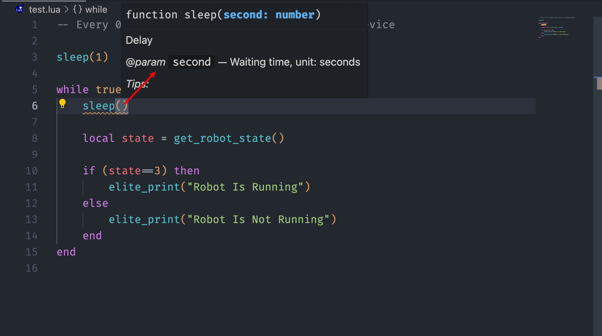
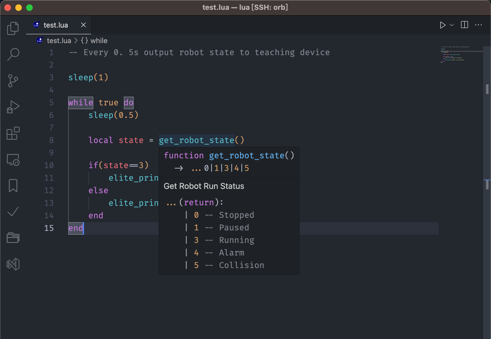
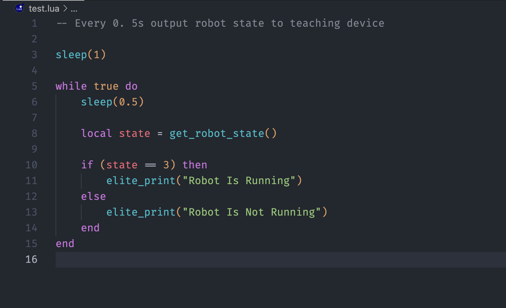
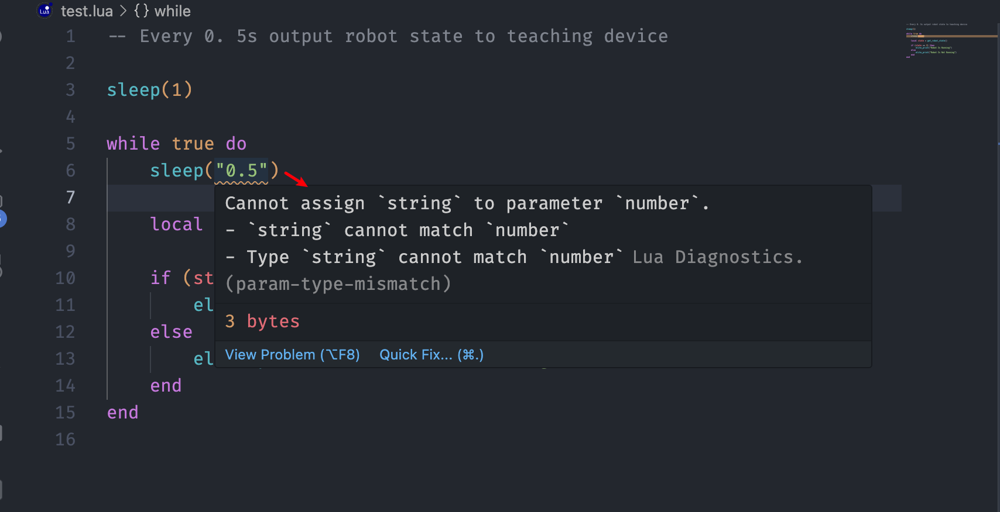
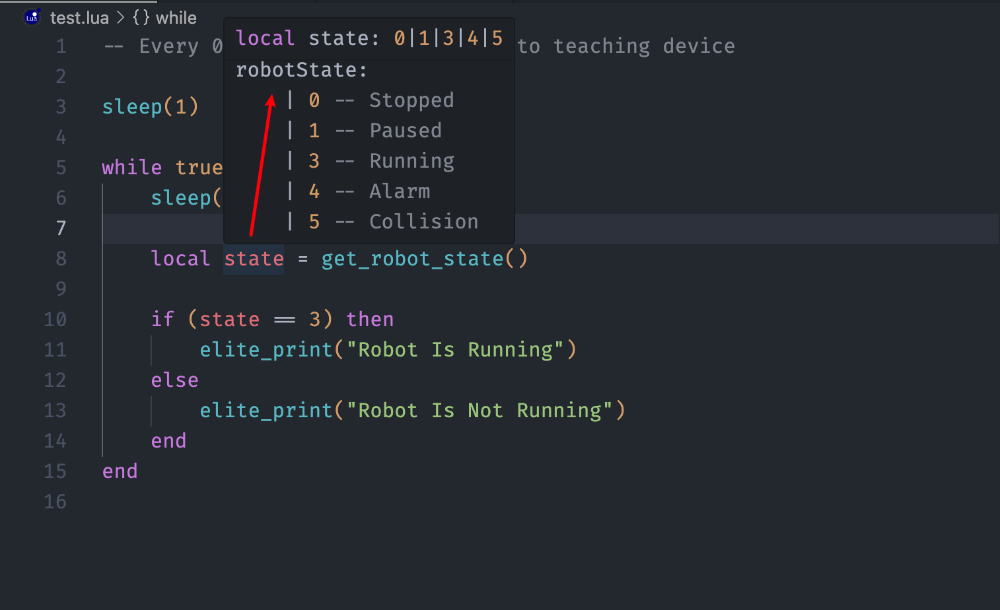
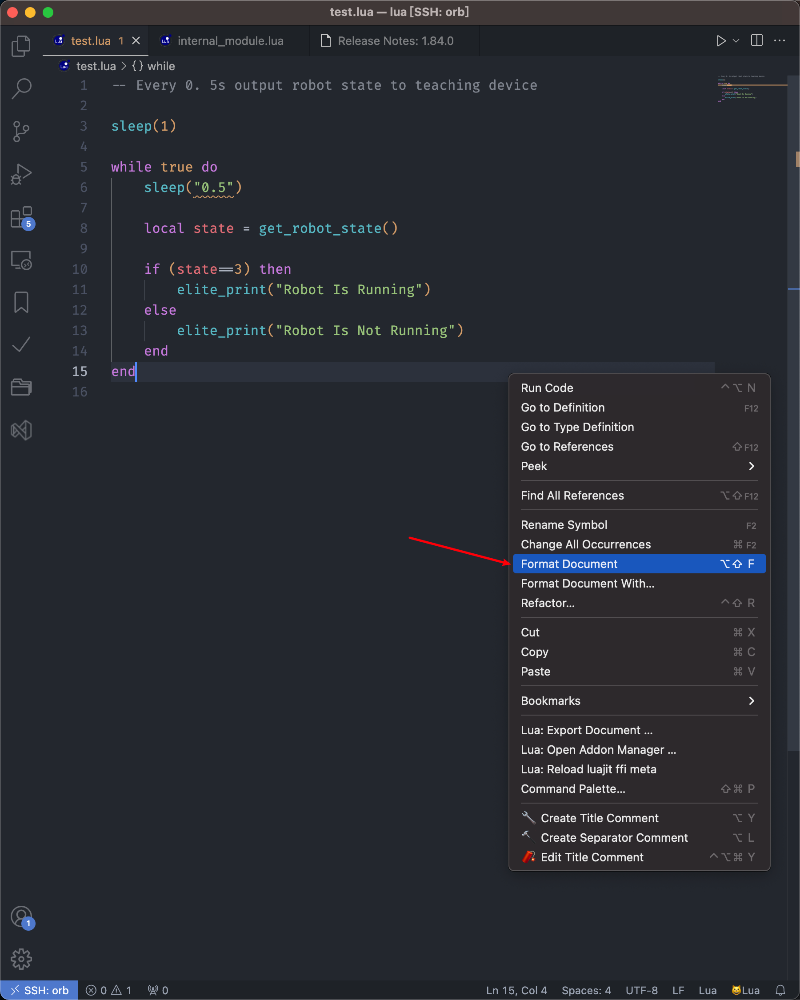

<div align=center>  </div>

# **Elite EC Series Robot Script For Lua**

#### 				**明 天 比 今 天 更 简 单 一 点**																	

#### 				Always Easier Than Before

> 艾利特技术论坛：[技术论坛](https://bbs.elibot.cn/)
>
> Elite Technology Forum：[Technology Forum](https://bbs.elibot.cn/forum/index/section/14.html)
>
> 艾利特学院（B站账号）：[艾利特学院](https://space.bilibili.com/548925152?spm_id_from=333.337.search-card.all.click)
>
> Elite College (Bilibili account)：[Elite College](https://space.bilibili.com/548925152?spm_id_from=333.337.search-card.all.click)


# Lua

艾利特机器人脚本采用Lua这种轻量小巧的脚本语言，可以更方便的嵌入机器人程序中，从而为应用程序提供灵活的扩展和定制功能，配合jbi程序可以完成多样化、高性能的控制需求。

Elite robot using the Lua script that lightweight compact scripting language that can be more easily embedded robot program, which provide flexibility for the application of extension and customization.Combining the jbi program can complete all kinds of high performance control requirements.


# 功能	Feature

本插件提供了艾利特协作机器人使用的函数代码块，同时附加上语法高亮，提高开发效率。

This extension provides function code blocks used by the Elite collaborative robot, and adds syntax highlighting to improve development efficiency.

### 自动补全	AutoCompletion


### 函数签名	SignatureHelp



### 悬停提示	Hover



### 语法高亮	Highlight



### 错误诊断	Diagnostics



### 类型提示	Type



### 格式化	Formatting




# 反馈	Feedback

如果你发现了任何错误，请联系我们！！！

If you find any errors, you can contact us by Github！！！

```
 https://github.com/JunJie-zhang-o/EliteScript-lua.git
```


# **Enjoy**!